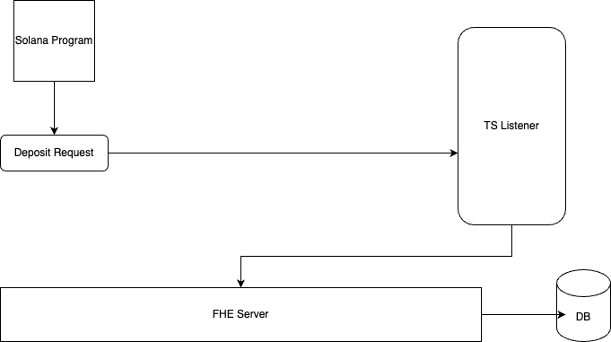
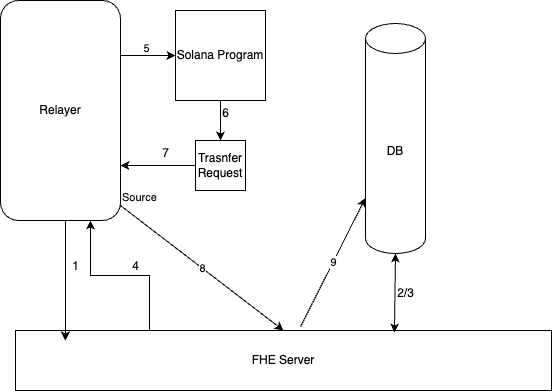

# TFHE Encryption Server with Solana Integration

The idea here is to create an off-chain server that handles FHE operations symbolically on the SVM. Essentially when an on-chain action is needed, an event will be emited and orginazed via a TS server where it then will be forwarded to the Rust backend where the encryption, FHE opertaions and decryption requests are handled. The Goal is to build a generalized FHE coprocessor that is native to the SVM, ideally including a wide range of operations, different FHE schemes and threshold decryption. Next steps include on-chain verification. 

## 🔍 Overview

This repository demonstrates a multi-component system for handling homomorphic encryption with SVM base:

1. **Rust Encryption Server**
   - Handles TFHE encryption/decryption
   - Provides REST API endpoints
   - Manages SQLite database storage
   - Generates and manages encryption keys (seperate script)

2. **Solana Program**
   - Records symbolic operations
   - Verifies transaction flow
   - Emits events for tracking

3. **TypeScript Listener**
   - Monitors Solana program events
   - Forwards requests to Rust server
   - Provides client interface

## Architecture 

Here is a sample walk through of how the depopsit flow works. First the user will call the deposit function to deposit a certain amount of lamports into the program. This will create a mapping from the user's address to a ciphertext that represents their lamport value. (down the road this can also be used for SPL tokens such as USDC). Next the TS Listner/relayer will pick up the event and forward the request to the Rust server. The Rust server will then use the FHE public key to encrypt the corresponding ciphertext and save it to the database. 

  

The following is a more complex example, since we need to request a valid ciphertext from the server before we are able to perform the transfer. This flow will be similar for any function that requires a ciphertext as an input. Down the road the idea will be to use a zero knowledgge proof to verify the ciphertext is valid without revealing any information about the plaintext, however for now we will mock this via a post request to the server. Say a user wants to transfer 1 of their deposited Sol.. they will first neede to request a ciphertext of the encrypted lamport value. From there, they will be given a pointer that they will use as an input to the transfer function (this is abstracted from the user). From there the flow is similar to the deposit example above. 

  

## Scripts

generate.sh: This script builds and runs the keys.rs program to generate the FHE public and secret keys.

clean_db.sh: This script cleans the db

run.sh: This script will run everyhting you need for a sample demo. First it starts the local solana validator, then it runs the TS listener, then the Rust server, then the Anchor tests. You can check if it ran correctly by checking the logs and/or db. 

## 🧪 Testing

The project includes multiple test suites: 
- Rust unit tests for encryption logic
- Integration tests for API endpoints
- Anchor tests for Solana program
- TypeScript tests for client functionality